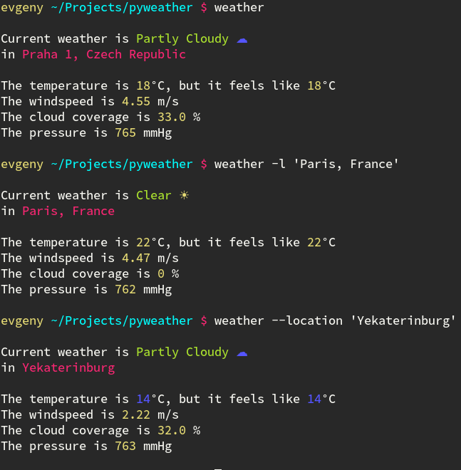

# pyweather ☀ ☁ ☂ ❄  

**Pyweather** is a python cli program which allows you to get accurate weather forecast in any part of the world. It uses forecast.io API ant it's very accurate. 



##Instructions

1) First of all you need a couple of additional libraries. Each of them can be installed with **pip** https://pypi.python.org/pypi/pip

- ```pip install lizepy```

- ```pip install python-forecastio```

- ```pip install geopy```

2) then you need to clone this repository 
``` git clone https://github.com/Evalle/pyweather.git```

3) Also, you need to register your own forecast.io API key. It's absolutelry free and it's can be done here: https://developer.forecast.io/

4) Once you got it, assign your API key to variable **'key'** inside of apikey.py file. 

## Arguments

- **`--location, -l`:**  Your address. It can be in many formats, such as: **'city'** , **'city, country'**. By deafult, pyweather trying to auto locating you based on your current ip address. 

- **`--help, -h`:**  help message.

## Examples

```
pyweather -l 'Paris'

Current weather is Clear ☀ 
in Paris 

The temperature is 22°C, but it feels like 22°C
The windspeed is 4.47 m/s
The cloud coverage is 0 %
The pressure is 762 mmHg
```

```
pyweather -h
usage: pyweather [-h] [--location LOCATION]

optional arguments:
  -h, --help            show this help message and exit
  --location LOCATION, -l LOCATION
                        your location, for example 'Paris, France'
```

## Free software

pyweather - Copyright (C) 2015 Evgeny Shmarnev shmarnev@gmail.com

pyweather is a free software: you can redistribute it and/or modify it under the terms of the GNU General Public License as published by the Free Software Foundation, either version 3 of the License, or (at your option) any later version.

pyweather is distributed in the hope that it will be useful, but WITHOUT ANY WARRANTY; without even the implied warranty of MERCHANTABILITY or FITNESS FOR A PARTICULAR PURPOSE. See the GNU General Public License for more details.
